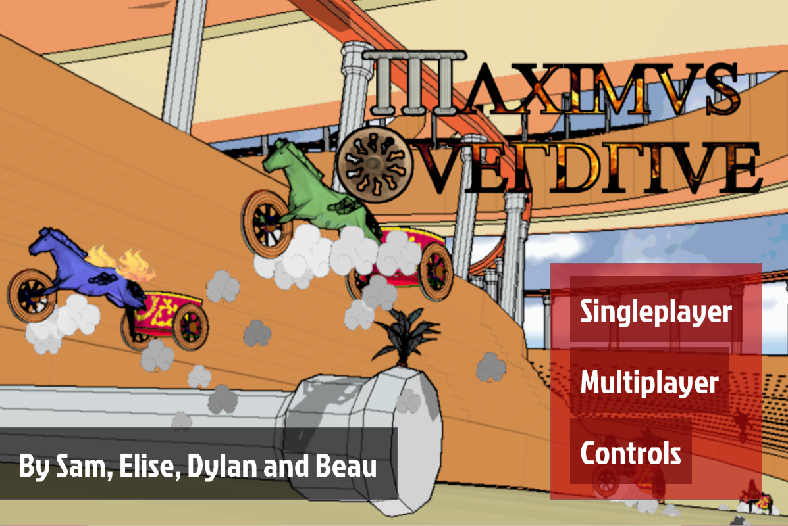
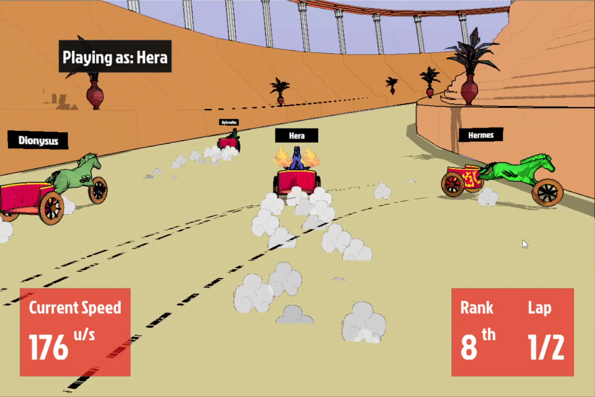
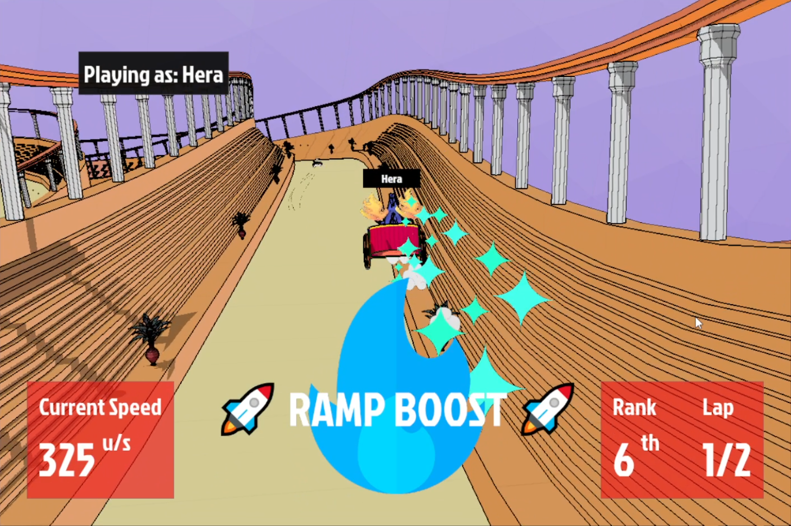
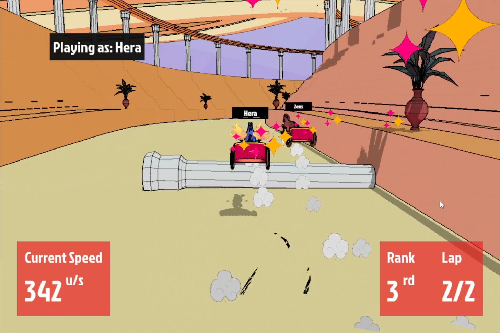
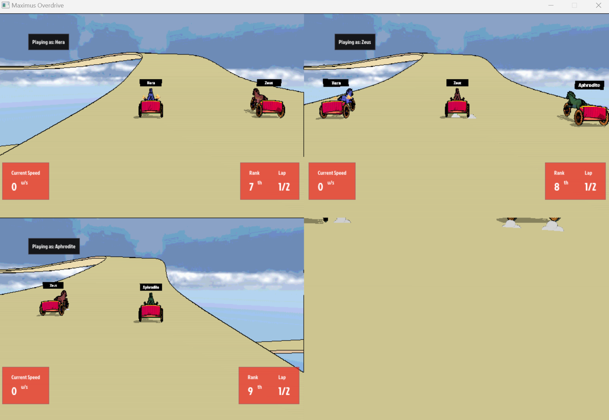

# Maximus Overdrive: an action packed chariot racing game!

Maximus Overdrive (or Cutthroat Coliseum) is a game where you must conquer a winding stretch of obstacles, ramps and of course, your opponents: all in the quest of glory!

It was written in C++ over the course of a single semester (February-April) in Winter 2023 at the University of Calgary as part of it's CPSC 585 (Computer Game Development) course.

It's main features are:
- beautiful cel-shaded graphics
- controller and mouse/keyboard support
- local multiplayer support (up to 4 players!), dynamically scaling the screen to fit the appropriate number of players on screen
- realistic physics & driving models (integrated with Nvidia PhysX)
- 3d sound

And under the hood:
- a lightnight fast entity-component-system which helped us more easily integrate several components like colliders with their textures all into one entity. 

## Screenshots:

Try not to skid out!

Take as many ramps as you can!

And don't forget to avoid the pillars blocking your path!

Make sure to play it with your friends, too! (only the track is rendered since this screenshot is an oldie from dev testing)

### Gameplay Video

Check out a gameplay video over at:

https://youtu.be/gV-7d2pARK4

## Credits

* Samuel Osweiler
  * graphics: everything... (cel-shading, billboards, particles, culling, camera, etc.)
* Elise Chevalier
  * gameplay: design lead, driving expert, level design, experimental designer (tethers, etc.)
  * systems: input
* Beau McCartney
  * systems: window, input, sound, integration (SDL, fmod), controller support
* Dylan Leclair
  * systems: ai, ui, ecs, race tracking, integration (physx, cmake), multi-controller support
  * gameplay: level design

* open source/integrated libraries:
  * nvidia physx
  * dear imgui
  * fmod
  * sdl2
  * OpenGL
  * SDL2
  * GTest
  * glm
  * glew  
  * assimp
  * tomlplusplus
  * imgui
  * Freetype  
  * SDL2_image
  * stb

* tools:
  * blender (level design)
  * GIMP (graphics)